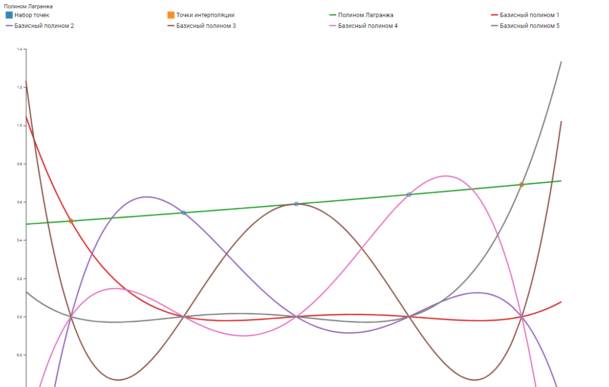
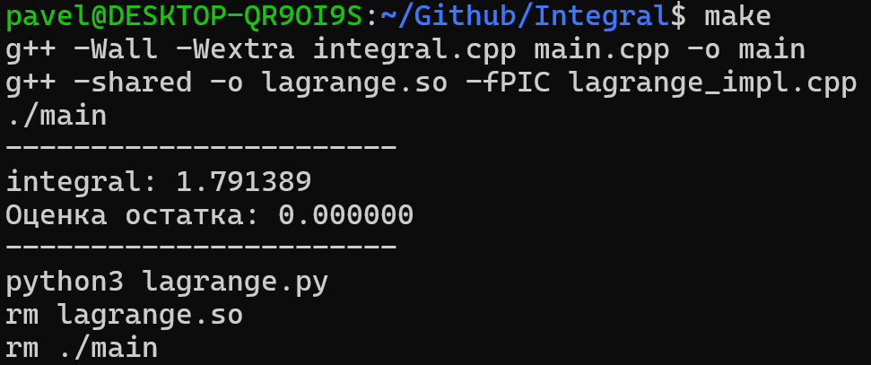

# Integral

## О программе

## Теория

## Как запустить (linux)

*Для запуска программы небходимо:*

1. `make`
2. *Вывод →*

> На *рисунке* видим посчитанный **интеграл** с точностью 0,0001 и **оценку** **остаточного члена формулы Тейлора**, оцененную через геометрическую прогрессию.
> 

> На *рисунке* видено множество функций. **P0**, **P1**, **P2**, **P3**, **P4** — *базисные полиномы Лагранжи*. **P** — *интерполяционный многочлен Лагранжа*. **f(x)**=**(cosh(sqrt(x))-1)/2** — *заданная функция*.
>